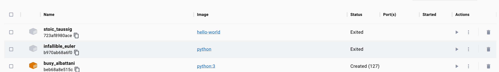

### Image
think of it as a zip file that holds an application
- contains *everything* the application needs to run
- think of the image as the executable

### Container
runnable instance of an image - think of a virtual machine
- think of the container as the running process

### Where to find images
can either be a repository or can locate in [docker hub](https://hub.docker.com/) (public docker images)

### Docker commands
`docker build -t <name of image>` - takes a docker file and creates an image using it (-t tags aka names your image)

`docker run <name of image>` - will run the container (it will also download the image if it is already not downloaded)
`docker pull <name of image>` - will download the image

`docker start <name of container OR container id>` - will start up an existing docker container (that is not already running)
`docker attach <name of container OR container id>` - will put you inside an interactive session for specified, running docker container

### Flags
`-i` interactive
`-t` terminal
- The idea is you do `-it` and it gives you an interactive terminal session
  
`--rm` by default exiting a container doesn't delete it (trash can).

`--name <name of the container>` gives the container name, it needs to be before the name of the container
  - For example, `docker run --rm -it --name <container name>`

`-d` detach
  - By default, unless specified, running a container will "attach it" - this means that the current terminal is taken over by the container. By detaching, you allow the application to run in the background, which in turn, frees up your terminal.
### Managing Containers
In Docker Desktop, if you do not specify the container to be removed (i.e. `--rm`) you will need to delete it manually (trash can icon)

Note: Status `Exited` means the container is no longer running, but any previous changes to the container state are still saved. 
- The container is no longer running (but it still exists)
- Adding the `--rm` flag not only stops the container from running, it also deletes it forever

`docker ps -a` - lists ALL containers (whether they're running or not)
`docker ps` - lists only RUNNING containers

## Docker Tutorials
https://docs.docker.com/get-started/
